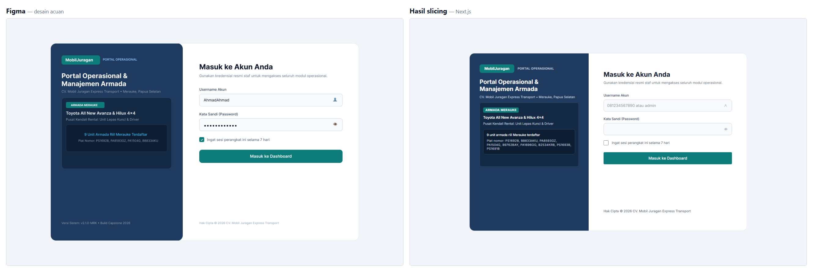
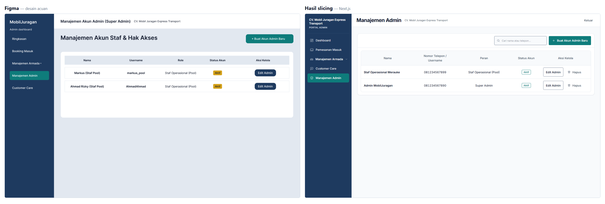

# MobilJuragan Web Dashboard

Aplikasi web dashboard admin dan staf operasional untuk **CV. Mobil Juragan Express Transport** di Merauke, Papua Selatan. Dashboard ini dirancang untuk monitoring armada kendaraan, pemrosesan antrean pemesanan (*booking queue*), konfirmasi tarif resmi, dan penanganan tiket Customer Care.

---

## 1. Arsitektur & Tech Stack

Dashboard dibangun dengan arsitektur frontend modern berbasis Server Components dan Client Components:


### Spesifikasi Teknologi:
- **Framework Web**: Next.js 16 (App Router)
- **Library UI**: React 19
- **Bahasa Pemrograman**: TypeScript 5
- **Styling**: Tailwind CSS 4 (via `@tailwindcss/postcss`)
- **Linting & Code Quality**: ESLint 9

---

## 2. Struktur Direktori Kunci

Berikut adalah struktur file penting dalam aplikasi dashboard:

```text
frontend/
├── app/
│   ├── layout.tsx              # Root layout, metadata global, font, & QueryProvider
│   ├── actions.ts              # Server Actions ("use server") pemanggil API Express
│   ├── not-found.tsx           # Halaman 404
│   ├── proxy.ts                # Gerbang sesi: verifikasi token sebelum halaman dibuka
│   ├── globals.css             # Tailwind CSS 4 & variabel desain global
│   ├── (auth)/login/           # Halaman masuk staf/admin
│   └── (dashboard)/            # Grup rute dashboard (butuh sesi)
│       ├── page.tsx            # Ringkasan operasional
│       ├── loading.tsx         # Skeleton saat data sedang dimuat
│       ├── error.tsx           # Error boundary dashboard
│       ├── admin/              # Manajemen akun staf & admin
│       ├── bookings/           # Antrean pemesanan & detail [id]
│       ├── customer-care/      # Meja kerja tiket bantuan
│       └── fleet/              # Katalog, kalender, dan roster supir
├── components/
│   ├── providers/              # QueryProvider (QueryClient lewat useState)
│   ├── ui/                     # Komponen dasar: Button, Table, Modal, StatusChip, dll
│   ├── layout/                 # DashboardShell, Sidebar, Topbar
│   ├── modals/                 # Modal form dan konfirmasi hapus
│   ├── admin/                  # Manajemen akun admin
│   ├── bookings/               # Tabel dan panel keputusan pemesanan
│   ├── fleet/                  # Tabel katalog, roster, dan kalender
│   └── support/                # Meja kerja tiket
├── lib/
│   ├── api.ts                  # Pemanggil API Express (server-only), termasuk autentikasi
│   ├── operations.ts           # Pemanggil API Express untuk data operasional (server-only)
│   ├── axios.ts                # Instance Axios untuk panggilan dari browser
│   ├── labels.ts               # Label bahasa Indonesia untuk status & peran
│   ├── format.ts               # Pemformat tanggal dan rentang tanggal
│   ├── navigation.ts           # Peta menu sidebar & judul halaman
│   ├── types.ts                # Tipe data bersama
│   └── uiText.ts               # Konstanta teks tampilan (placeholder nominal, dll)
├── public/                     # Aset gambar & ikon
├── .env.example                # Template konfigurasi environment variable
├── next.config.ts              # Konfigurasi runtime Next.js
├── package.json                # Manifest dependency & skrip npm
└── tsconfig.json               # Konfigurasi compiler TypeScript
```

---

## 3. Prasyarat Sistem

- **Node.js**: Versi $\ge$ 20.x LTS
- **npm**: Versi $\ge$ 10.x
- **Backend API**: Layanan backend MobilJuragan aktif di port 4000 dengan basis data **MariaDB/MySQL** (lihat repositori `mobiljuragan-backend`).
- **Integrasi Penuh**: Fitur Login (`/login`) dan Manajemen Admin (`/admin`) telah terhubung langsung ke backend Express dan basis data MariaDB melalui Server Actions (`useActionState`, `useFormStatus`) dan lapisan data aman `lib/api.ts` (`server-only`).

---

## 4. Panduan Menjalankan

### Langkah 1: Install Dependencies
```bash
npm install
```

### Langkah 2: Konfigurasi Environment Variable
Salin template konfigurasi `.env.example` ke `.env.local`:
```bash
cp .env.example .env.local
```
Pastikan variabel `NEXT_PUBLIC_API_URL` mengarah ke alamat backend:
```env
NEXT_PUBLIC_API_URL="http://localhost:4000/api/v1"
```

### Langkah 3: Menjalankan Server Development
```bash
npm run dev
```
Dashboard akan aktif pada: `http://localhost:3000`.

### Langkah 4: Perintah Build & Quality Check
```bash
# Typecheck TypeScript
npm run typecheck

# Production build
npm run build

# Menjalankan hasil build production
npm run start

# Linter kode
npm run lint

# Format kode dengan Prettier
npm run format

# Memeriksa format tanpa mengubah berkas
npm run format:check
```

Seluruh kode dashboard mengikuti satu gaya penulisan yang dijaga Prettier (kutip dua, 2 spasi, lebar 100 karakter). Yang dikecualikan diatur di `.prettierignore`, antara lain `.next/`, `package-lock.json`, dan `README.md`.

---

## 5. Strategi Rendering per Halaman (Next.js App Router)

Sesuai ketentuan teknis Web Framework, strategi render ditentukan berdasarkan karakteristik data masing-masing halaman:

Seluruh halaman yang menampilkan data operasional memakai **Dynamic SSR** (`export const dynamic = "force-dynamic"`). Alasannya sama di semua halaman itu: isinya berasal dari tabel MariaDB yang berubah setiap kali ada pemesanan, penugasan supir, atau perubahan status armada, sehingga data yang dipra-render akan cepat basi. Halaman yang murni tampilan tetap statis.

| Halaman | Rute URL | Strategi Render | Alasan Pemilihan Strategi |
| :--- | :--- | :--- | :--- |
| **Ringkasan Operasional** | `/` | **Dynamic (SSR)** | Antrean konfirmasi dan status armada harus mencerminkan keadaan terkini tiap request. |
| **Login Staf/Admin** | `/login` | **Dynamic (SSR)** | Jumlah dan plat armada yang ditampilkan diambil dari database, bukan angka tetap. |
| **Manajemen Admin** | `/admin` | **Dynamic (SSR)** | Daftar akun staf/admin berubah setiap ada penambahan atau perubahan status akun. |
| **Pemesanan Masuk** | `/bookings` | **Dynamic (SSR)** | Antrean pesanan bertambah setiap pelanggan mengirim pesanan baru. |
| **Detail Pemesanan** | `/bookings/[id]` | **Dynamic (SSR)** | Status dan tarif berubah mengikuti proses verifikasi tim, tidak bisa dipra-render. |
| **Katalog Armada** | `/fleet/catalog` | **Dynamic (SSR)** | Status operasional tiap unit berubah saat disewa atau masuk perawatan. |
| **Kalender Armada** | `/fleet/calendar` | **Dynamic (SSR)** | Jadwal blokir dihitung dari pemesanan aktif sehingga berubah tiap hari. |
| **Manajemen Supir** | `/fleet/drivers` | **Dynamic (SSR)** | Kesiapan supir berubah mengikuti penugasan aktif dan sakelar kesiapan. |
| **Customer Care** | `/customer-care` | **Dynamic (SSR)** | Percakapan tiket bertambah setiap ada pesan atau balasan baru. |
| **Contoh Keadaan Kosong** | `/empty` | **Static** | Halaman rujukan tampilan, isinya tetap dan tidak bergantung data. |
| **Contoh Error Boundary** | `/error-boundary` | **Static** | Halaman rujukan tampilan kegagalan, tidak memuat data. |

---

## 6. Nilai Tambah (Opsional): useOptimistic & TanStack Query (React Query) + Axios

Sesuai butir ketentuan nilai tambah (*extra credit*) pada soal UTS Web Framework:
- **`useOptimistic` (Interaksi Instan 0ms)**: Diterapkan pada pengubahan status aktif/nonaktif akun staf/admin di [`components/admin/AdminAccountsTable.tsx`](components/admin/AdminAccountsTable.tsx) menggunakan `useOptimistic` dan `startTransition`. Tampilan status langsung berganti secara instan mendahului respons jaringan tanpa jeda loading.
- **Query Provider**: `QueryClient` diinisialisasi melalui `useState` di dalam [`components/providers/QueryProvider.tsx`](components/providers/QueryProvider.tsx) dan membungkus seluruh aplikasi pada root layout.
- **Data Fetching & Caching (`useQuery`)**: Diimplementasikan pada tabel interaktif [`components/admin/AdminAccountsTable.tsx`](components/admin/AdminAccountsTable.tsx) bersama fitur pencarian instan (*live search*), memanfaatkan data awal (*initialData*) dari SSR.
- **Mutasi & Invalidasi Cache (`useMutation` & `invalidateQueries`)**: Mutasi status akun secara langsung memicu invalidasi query `adminAccounts`, menyinkronkan data client browser dengan REST API Express dan MariaDB tanpa reload halaman.
- **Konfigurasi CORS**: Backend Express telah mengaktifkan middleware `cors()` secara terbuka sehingga request langsung dari Axios di browser berjalan tanpa hambatan CORS.

---

## 7. Perbandingan Figma vs Hasil Slicing

Tangkapan diambil pada viewport **1440x900**, sama dengan ukuran frame Figma, supaya proporsinya bisa dibandingkan langsung. Frame acuan: `Screen / Login Admin` (`49:9355`) dan `Screen / Manajemen Akun Admin` (`49:8879`) pada halaman **dashboard** berkas *Mobiljuragan*.

### 7.1 Halaman Login



| Bagian | Figma | Hasil slicing | Keterangan |
| :--- | :--- | :--- | :--- |
| Warna, tipografi, ikon | Navy + teal, Inter, ikon SVG | Sama | Sesuai |
| Susunan panel | Panel navy kiri, form kanan | Sama | Sesuai |
| Isi panel armada | Jumlah unit + daftar plat | Sama, diambil dari database | Sesuai, tidak ditulis tetap |
| Ukuran kartu | 1120x720 | 1008x648 (skala 90%) | **Disengaja**: kartu 720px membuat halaman menggulir di laptop 1366x768. Tinggi kontrol tetap 44px agar target sentuh tidak mengecil. |
| Checkbox "Ingat sesi" | Tercentang | Tidak tercentang | **Disengaja**: default aman, sesi tidak otomatis tersimpan 7 hari |
| Baris "Versi Sistem" | Ada di dasar panel navy | Belum ada | Selisih tampilan, tidak memengaruhi fungsi |

### 7.2 Halaman Manajemen Admin



| Bagian | Figma | Hasil slicing | Keterangan |
| :--- | :--- | :--- | :--- |
| Warna, tabel, chip status | Navy, tabel garis, chip | Sama | Sesuai |
| Kolom tabel | Nama, Username, Role, Status, Aksi | Sama | Sesuai |
| Teks peran | "Staf Operasional (Pool)" | Sama | Sesuai |
| Username | Username teks (`markus_pool`) | Nomor telepon (`081234567899`) | Backend memakai nomor telepon sebagai identitas masuk, jadi kolomnya menampilkan data nyata |
| Kotak pencarian | Tidak ada | Ada | **Tambahan** untuk nilai ekstra React Query (pencarian langsung) |
| Tombol aksi | Hanya "Edit Admin" | "Edit Admin" + "Hapus" | Hapus ditambahkan karena endpoint `DELETE /admin/users/:id` memang ada |
| Judul halaman | H1 "Manajemen Akun Staf & Hak Akses" | Hanya judul di topbar | Judul H1 dihapus agar tidak mengulang nama halaman tiga kali (topbar, menu sidebar, dan judul konten) |

Catatan: seluruh perbedaan di atas adalah keputusan yang diambil sadar, bukan bagian yang belum selesai. Tangkapan layar di atas dihasilkan ulang oleh skrip `.verify/buat-perbandingan-figma.mjs`, sehingga bisa diperbarui kapan saja setelah tampilan berubah.
