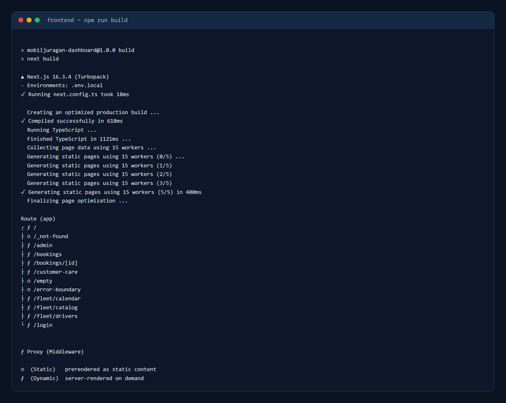

# MobilJuragan Web Dashboard

Aplikasi web dashboard admin dan staf operasional untuk **CV. Mobil Juragan Express Transport** di Merauke, Papua Selatan. Dashboard ini dirancang untuk monitoring armada kendaraan, pemrosesan antrean pemesanan (*booking queue*), konfirmasi tarif resmi, dan penanganan tiket Customer Care.

---

## 1. Arsitektur & Tech Stack

Dashboard dibangun dengan arsitektur frontend modern berbasis Server Components dan Client Components:


### Spesifikasi Teknologi:
- **Framework Web**: Next.js 16 (App Router)
- **Library UI**: React 19
- **Bahasa Pemrograman**: TypeScript 5
- **Styling**: Tailwind CSS 4 (via `@tailwindcss/postcss`)
- **Linting & Code Quality**: ESLint 9

---

## 2. Perbandingan Figma vs Hasil Slicing

Tangkapan diambil pada viewport **1440x900**, sama dengan ukuran frame Figma, supaya proporsinya bisa dibandingkan langsung. Frame acuan: `Screen / Login Admin` (`49:9355`) dan `Screen / Manajemen Akun Admin` (`49:8879`) pada halaman **dashboard** berkas *Mobiljuragan*. Desain Figma ikut disesuaikan agar sama dengan hasil slicing, sehingga kedua sisi pada gambar di bawah ini mencerminkan tampilan akhir.

### 2.1 Halaman Login


| Bagian | Figma | Hasil slicing | Keterangan |
| :--- | :--- | :--- | :--- |
| Warna, tipografi, ikon | Navy + teal, Inter, ikon SVG | Sama | Sesuai |
| Susunan panel | Panel navy kiri, form kanan | Sama | Sesuai |
| Isi panel armada | Jumlah unit + daftar plat | Sama, diambil dari database | Sesuai, tidak ditulis tetap |
| Ukuran kartu | 1008x648 | 1008x648 | Sesuai. Desain Figma ikut diperkecil dari 1120x720, karena kartu 720px membuat halaman menggulir di laptop 1366x768. Tinggi kontrol tetap 44px agar target sentuh tidak mengecil. |
| Checkbox "Ingat sesi" | Tidak tercentang | Tidak tercentang | Sesuai. Desain Figma ikut diubah dari tercentang menjadi tidak tercentang, mengikuti default aman di aplikasi. |
| Isi kolom form | Terisi data contoh | Kosong dengan placeholder | Perbedaan keadaan tampilan, bukan desain |
| Teks panel armada | "9 unit armada riil Merauke terdaftar" | Sama | Sesuai, termasuk huruf besar-kecil |

### 2.2 Halaman Manajemen Admin


| Bagian | Figma | Hasil slicing | Keterangan |
| :--- | :--- | :--- | :--- |
| Warna, tabel, chip status | Navy, tabel garis, chip | Sama | Sesuai |
| Teks peran | "Staf Operasional (Pool)" | Sama | Sesuai |
| Menu sidebar | Dashboard, Pemesanan Masuk, Manajemen Armada, Customer Care, Manajemen Admin | Sama | Sesuai, termasuk urutan dan sorotan menu aktif |
| Judul topbar | "Manajemen Admin" + tombol "Keluar" | Sama | Sesuai |
| Kotak pencarian | Ada | Ada | Sesuai |
| Kepala kolom | Nama, Nomor Telepon / Username, Peran, Status Akun, Aksi Kelola | Sama | Sesuai |
| Tombol aksi | Hanya "Edit Admin" | "Edit Admin" + "Hapus" | Hapus hanya ada di aplikasi, karena endpoint `DELETE /admin/users/:id` memang tersedia |
| Data contoh | Markus (Staf Pool) / markus_pool | Staf Operasional Merauke / 081234567899 | Isi tabel mengikuti data nyata di MariaDB, bukan contoh di desain |

Catatan: desain Figma ikut diperbarui pada 7 Oktober 2026 agar selaras dengan hasil slicing. Perbedaan yang tersisa hanyalah keputusan sadar, bukan bagian yang belum selesai. Tangkapan layar di atas dihasilkan ulang oleh skrip `.verify/buat-perbandingan-figma.mjs`, sehingga bisa diperbarui kapan saja setelah tampilan berubah.

---

## 3. Struktur Direktori Kunci

Berikut adalah struktur file penting dalam aplikasi dashboard:

```text
frontend/
├── app/
│   ├── layout.tsx              # Root layout, metadata global, font, & QueryProvider
│   ├── actions.ts              # Server Actions ("use server") pemanggil API Express
│   ├── not-found.tsx           # Halaman 404
│   ├── proxy.ts                # Gerbang sesi: verifikasi token sebelum halaman dibuka
│   ├── globals.css             # Tailwind CSS 4 & variabel desain global
│   ├── (auth)/login/           # Halaman masuk staf/admin
│   └── (dashboard)/            # Grup rute dashboard (butuh sesi)
│       ├── page.tsx            # Ringkasan operasional
│       ├── loading.tsx         # Skeleton saat data sedang dimuat
│       ├── error.tsx           # Error boundary dashboard
│       ├── admin/              # Manajemen akun staf & admin
│       ├── bookings/           # Antrean pemesanan & detail [id]
│       ├── customer-care/      # Meja kerja tiket bantuan
│       └── fleet/              # Katalog, kalender, dan roster supir
├── components/
│   ├── providers/              # QueryProvider (QueryClient lewat useState)
│   ├── ui/                     # Komponen dasar: Button, Table, Modal, StatusChip, dll
│   ├── layout/                 # DashboardShell, Sidebar, Topbar
│   ├── modals/                 # Modal form dan konfirmasi hapus
│   ├── admin/                  # Manajemen akun admin
│   ├── bookings/               # Tabel dan panel keputusan pemesanan
│   ├── fleet/                  # Tabel katalog, roster, dan kalender
│   └── support/                # Meja kerja tiket
├── lib/
│   ├── api.ts                  # Pemanggil API Express (server-only), termasuk autentikasi
│   ├── operations.ts           # Pemanggil API Express untuk data operasional (server-only)
│   ├── axios.ts                # Instance Axios untuk panggilan dari browser
│   ├── labels.ts               # Label bahasa Indonesia untuk status & peran
│   ├── format.ts               # Pemformat tanggal dan rentang tanggal
│   ├── navigation.ts           # Peta menu sidebar & judul halaman
│   ├── types.ts                # Tipe data bersama
│   └── uiText.ts               # Konstanta teks tampilan (placeholder nominal, dll)
├── public/                     # Aset gambar & ikon
├── .env.example                # Template konfigurasi environment variable
├── next.config.ts              # Konfigurasi runtime Next.js
├── package.json                # Manifest dependency & skrip npm
└── tsconfig.json               # Konfigurasi compiler TypeScript
```

---

## 4. Prasyarat Sistem

- **Node.js**: Versi $\ge$ 20.x LTS
- **npm**: Versi $\ge$ 10.x
- **Backend API**: Layanan backend MobilJuragan aktif di port 4000 dengan basis data **MariaDB/MySQL** (lihat repositori `mobiljuragan-backend`).
- **Integrasi Penuh**: Fitur Login (`/login`) dan Manajemen Admin (`/admin`) telah terhubung langsung ke backend Express dan basis data MariaDB melalui Server Actions (`useActionState`, `useFormStatus`) dan lapisan data aman `lib/api.ts` (`server-only`).

---

## 5. Panduan Menjalankan

### Langkah 1: Install Dependencies
```bash
npm install
```

### Langkah 2: Konfigurasi Environment Variable
Salin template konfigurasi `.env.example` ke `.env.local`:
```bash
cp .env.example .env.local
```
Pastikan variabel `NEXT_PUBLIC_API_URL` mengarah ke alamat backend:
```env
NEXT_PUBLIC_API_URL="http://localhost:4000/api/v1"
```

### Langkah 3: Menjalankan Server Development
```bash
npm run dev
```
Dashboard akan aktif pada: `http://localhost:3000`.

### Langkah 4: Perintah Build & Quality Check
```bash
# Typecheck TypeScript
npm run typecheck

# Production build
npm run build

# Menjalankan hasil build production
npm run start

# Linter kode
npm run lint

# Format kode dengan Prettier
npm run format

# Memeriksa format tanpa mengubah berkas
npm run format:check
```

Seluruh kode dashboard mengikuti satu gaya penulisan yang dijaga Prettier (kutip dua, 2 spasi, lebar 100 karakter). Yang dikecualikan diatur di `.prettierignore`, antara lain `.next/`, `package-lock.json`, dan `README.md`.

---

## 6. Strategi Rendering per Halaman (Next.js App Router)

Strategi render tiap halaman ditentukan berdasarkan karakteristik datanya:

Seluruh halaman yang menampilkan data operasional memakai **Dynamic SSR** (`export const dynamic = "force-dynamic"`). Alasannya sama di semua halaman itu: isinya berasal dari tabel MariaDB yang berubah setiap kali ada pemesanan, penugasan supir, atau perubahan status armada, sehingga data yang dipra-render akan cepat basi. Halaman yang murni tampilan tetap statis.

| Halaman | Rute URL | Strategi Render | Alasan Pemilihan Strategi |
| :--- | :--- | :--- | :--- |
| **Ringkasan Operasional** | `/` | **Dynamic (SSR)** | Antrean konfirmasi dan status armada harus mencerminkan keadaan terkini tiap request. |
| **Login Staf/Admin** | `/login` | **Dynamic (SSR)** | Jumlah dan plat armada yang ditampilkan diambil dari database, bukan angka tetap. |
| **Manajemen Admin** | `/admin` | **Dynamic (SSR)** | Daftar akun staf/admin berubah setiap ada penambahan atau perubahan status akun. |
| **Pemesanan Masuk** | `/bookings` | **Dynamic (SSR)** | Antrean pesanan bertambah setiap pelanggan mengirim pesanan baru. |
| **Detail Pemesanan** | `/bookings/[id]` | **Dynamic (SSR)** | Status dan tarif berubah mengikuti proses verifikasi tim, tidak bisa dipra-render. |
| **Katalog Armada** | `/fleet/catalog` | **Dynamic (SSR)** | Status operasional tiap unit berubah saat disewa atau masuk perawatan. |
| **Kalender Armada** | `/fleet/calendar` | **Dynamic (SSR)** | Jadwal blokir dihitung dari pemesanan aktif sehingga berubah tiap hari. |
| **Manajemen Supir** | `/fleet/drivers` | **Dynamic (SSR)** | Kesiapan supir berubah mengikuti penugasan aktif dan sakelar kesiapan. |
| **Customer Care** | `/customer-care` | **Dynamic (SSR)** | Percakapan tiket bertambah setiap ada pesan atau balasan baru. |
| **Contoh Keadaan Kosong** | `/empty` | **Static** | Halaman rujukan tampilan, isinya tetap dan tidak bergantung data. |
| **Contoh Error Boundary** | `/error-boundary` | **Static** | Halaman rujukan tampilan kegagalan, tidak memuat data. |

### Bukti hasil `npm run build`



Build selesai tanpa error dan menghasilkan **12 rute**: 9 bertanda `ƒ` (Dynamic, dirender saat diminta) dan 3 bertanda `○` (Static, sudah disiapkan saat build). Tiga yang statis adalah dua halaman rujukan tampilan ditambah halaman 404 bawaan Next.js. Jumlah dan tanda pada keluaran ini cocok dengan tabel strategi render di atas.

Selain itu terlihat `ƒ Proxy (Middleware)` — gerbang sesi yang memeriksa token sebelum halaman dashboard dibuka.

---

## 7. useOptimistic & TanStack Query (React Query) + Axios

- **`useOptimistic` (Interaksi Instan 0ms)**: Diterapkan pada pengubahan status aktif/nonaktif akun staf/admin di [`components/admin/AdminAccountsTable.tsx`](components/admin/AdminAccountsTable.tsx) menggunakan `useOptimistic` dan `startTransition`. Tampilan status langsung berganti secara instan mendahului respons jaringan tanpa jeda loading.
- **Query Provider**: `QueryClient` diinisialisasi melalui `useState` di dalam [`components/providers/QueryProvider.tsx`](components/providers/QueryProvider.tsx) dan membungkus seluruh aplikasi pada root layout.
- **Data Fetching & Caching (`useQuery`)**: Diimplementasikan pada tabel interaktif [`components/admin/AdminAccountsTable.tsx`](components/admin/AdminAccountsTable.tsx) bersama fitur pencarian instan (*live search*), memanfaatkan data awal (*initialData*) dari SSR.
- **Mutasi & Invalidasi Cache (`useMutation` & `invalidateQueries`)**: Mutasi status akun secara langsung memicu invalidasi query `adminAccounts`, menyinkronkan data client browser dengan REST API Express dan MariaDB tanpa reload halaman.
- **Konfigurasi CORS**: Backend Express telah mengaktifkan middleware `cors()` secara terbuka sehingga request langsung dari Axios di browser berjalan tanpa hambatan CORS.

---

## 8. Daftar Endpoint API yang Dipakai Frontend

Seluruh data dashboard diambil dari REST API Express buatan sendiri di `http://localhost:4000/api/v1`. Tidak ada satu pun data contoh yang ditulis langsung di komponen. Kolom **Dipakai di** menunjukkan halaman atau komponen frontend yang memanggilnya.

| Modul | Method | Endpoint | Akses | Dipakai di |
| :--- | :--- | :--- | :--- | :--- |
| Health | `GET` | `/health` | Publik | Pemeriksaan backend aktif |
| Katalog | `GET` | `/vehicles?operationalStatus=ALL` | Publik | Katalog, Kalender, Ringkasan |
| Katalog | `GET` | `/vehicles/categories` | Publik | Filter kategori katalog |
| Katalog | `GET` | `/vehicles/:id` | Publik | Detail pemesanan |
| Auth Admin | `POST` | `/admin/auth/login` | Publik | **Halaman Login** |
| Auth Admin | `GET` | `/admin/auth/me` | Admin/Staff | Gerbang sesi (`proxy.ts`) |
| Akun Admin | `GET` | `/admin/users` | Admin/Staff | **Manajemen Admin** (SSR + React Query) |
| Akun Admin | `POST` | `/admin/users` | Admin/Staff | **Manajemen Admin** — tambah akun |
| Akun Admin | `GET` | `/admin/users/:id` | Admin/Staff | Tersedia di API, belum dipanggil frontend |
| Akun Admin | `PATCH` | `/admin/users/:id` | Admin/Staff | **Manajemen Admin** — ubah akun & status |
| Akun Admin | `DELETE` | `/admin/users/:id` | Admin/Staff | **Manajemen Admin** — hapus akun |
| Pemesanan Admin | `GET` | `/admin/bookings` | Admin/Staff | Pemesanan Masuk, Ringkasan |
| Pemesanan Admin | `GET` | `/admin/bookings/:id` | Admin/Staff | Detail Pemesanan |
| Pemesanan Admin | `PATCH` | `/admin/bookings/:id/status` | Admin/Staff | Konfirmasi tarif & ubah status |
| Pemesanan Admin | `PATCH` | `/admin/bookings/:id/driver` | Admin/Staff | Tugaskan supir |
| Armada Admin | `GET` | `/admin/fleet/calendar` | Admin/Staff | Kalender Armada |
| Armada Admin | `PATCH` | `/admin/vehicles/:id/status` | Admin/Staff | Ubah status unit di Katalog |
| Supir Admin | `GET` | `/admin/drivers` | Admin/Staff | Manajemen Supir, Detail Pemesanan |
| Supir Admin | `POST` | `/admin/drivers` | Admin/Staff | Tambah supir |
| Supir Admin | `GET` | `/admin/drivers/:id` | Admin/Staff | Detail supir |
| Supir Admin | `PATCH` | `/admin/drivers/:id` | Admin/Staff | Ubah data supir |
| Supir Admin | `PATCH` | `/admin/drivers/:id/readiness` | Admin/Staff | Sakelar kesiapan SIAGA/LIBUR |
| Supir Admin | `DELETE` | `/admin/drivers/:id` | Admin/Staff | Nonaktifkan supir |
| Customer Care | `GET` | `/admin/tickets` | Admin/Staff | Customer Care |
| Customer Care | `POST` | `/admin/tickets` | Admin/Staff | Tersedia di API, belum dipanggil frontend |
| Customer Care | `GET` | `/admin/tickets/:id` | Admin/Staff | Percakapan tiket |
| Customer Care | `PATCH` | `/admin/tickets/:id/status` | Admin/Staff | Ubah status tiket |
| Customer Care | `POST` | `/admin/tickets/:id/messages` | Admin/Staff | Kirim balasan tim |
| Pemesanan Pelanggan | `POST` | `/bookings` | Pelanggan | Dipakai aplikasi mobile (rencana) |
| Pemesanan Pelanggan | `GET` | `/bookings` | Pelanggan | Dipakai aplikasi mobile (rencana) |
| Pemesanan Pelanggan | `GET` | `/bookings/:id` | Pelanggan | Dipakai aplikasi mobile (rencana) |
| Pemesanan Pelanggan | `GET` | `/bookings/:id/status` | Pelanggan | Dipakai aplikasi mobile (rencana) |
| Auth Pelanggan | `POST` | `/auth/otp/request` | Publik | Dipakai aplikasi mobile (rencana) |
| Auth Pelanggan | `POST` | `/auth/otp/verify` | Publik | Dipakai aplikasi mobile (rencana) |

**Catatan cara frontend memanggil API:**

- **Server Component & Server Action** memanggil lewat [`lib/api.ts`](lib/api.ts) dan [`lib/operations.ts`](lib/operations.ts), keduanya bertanda `import "server-only"`. Panggilan ini terjadi antar-server sehingga tidak terkena aturan CORS.
- **Client Component** (tabel Manajemen Admin) memanggil lewat Axios di [`lib/axios.ts`](lib/axios.ts). Karena browser yang memanggil langsung, CORS di backend harus aktif — dan memang sudah.
- Endpoint bertanda **Admin/Staff** menolak permintaan tanpa token yang sah dengan status `401`.

Dokumentasi payload lengkap tiap endpoint ada di `docs/README.md` pada repositori **mobiljuragan-backend**.
